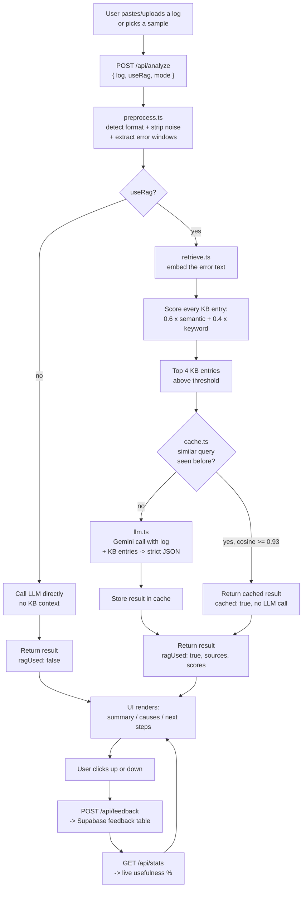

# Deployment Issue Troubleshooting Assistant

A single-agent GenAI web app that takes a deployment log or error message and returns a
plain-language summary, ranked probable causes, and next steps — grounded in a
troubleshooting knowledge base via RAG, with a semantic cache to cut repeat LLM calls
and a feedback loop to measure real usefulness.

This document explains **how data flows through the system** and **what every file does**,
so someone new to the codebase can get oriented without reading all the source first.

---

## 1. Solution Flow (end to end)



**In words:**
1. The user submits a log through the UI (or picks a sample).
2. The log is cleaned and the relevant error lines are extracted (`preprocess.ts`).
3. If RAG is on, the error text is embedded and matched against a knowledge base
   using a hybrid score (semantic similarity + exact error-pattern match) (`retrieve.ts`).
4. Before calling the LLM, a semantic cache is checked — if a near-identical error was
   analyzed recently, that cached result is returned instantly (`cache.ts`).
5. Otherwise, the LLM is called once with the log and the retrieved KB entries, and asked
   to return strict JSON: summary, ranked causes, next steps, severity (`llm.ts`).
6. The UI displays the result. The user can mark it useful or not; that feedback is stored
   and rolled up into a live usefulness percentage (`store.ts`, Supabase).

---

## 2. Folder Structure

```
log-assistant/
├── app/
│   ├── page.tsx                # Main UI (single page)
│   ├── layout.tsx              # Root HTML shell
│   └── api/
│       ├── analyze/route.ts    # Core pipeline: preprocess -> retrieve -> cache -> LLM
│       ├── feedback/route.ts   # Stores a 👍/👎 vote
│       └── stats/route.ts      # Returns live usefulness %
├── lib/
│   ├── preprocess.ts           # Format detection, cleanup, error-window extraction
│   ├── retrieve.ts             # Hybrid RAG retrieval over the knowledge base
│   ├── embed.ts                # Gemini embeddings + cosine similarity
│   ├── cache.ts                # In-memory semantic cache (reuses the query embedding)
│   ├── llm.ts                  # Gemini generation call + JSON schema/prompt
│   ├── store.ts                # Supabase REST client for feedback/stats
│   └── samples.ts              # Sample logs shown as quick-pick buttons in the UI
├── data/
│   ├── kb.json                 # Knowledge base: 43 known error patterns and fixes
│   ├── kb-embeddings.json      # Precomputed embeddings for kb.json (generated, not hand-written)
│   └── eval-set.json           # 23 test logs with the expected correct KB match
├── scripts/
│   ├── embed-kb.ts             # One-off script: embeds kb.json -> kb-embeddings.json
│   └── eval-retrieval.ts       # Compares keyword vs semantic vs hybrid hit-rate
├── supabase.sql                # Table definition for feedback storage
└── .env.example                # All environment variables, documented inline
```

---

## 3. Module-by-Module Documentation

### `lib/preprocess.ts`
Takes the raw pasted log and prepares it for the LLM and for retrieval.
- `detectFormat(log)` — regex-based sniffing to label the log as `kubernetes`, `docker`,
  `npm`, `maven`, `github-actions`, `jenkins`, or `generic`. Shown in the UI, and passed
  to the LLM as context.
- `normalize(log)` — strips ANSI color codes and leading timestamps, drops blank lines.
- `extractErrorWindows(log, context, maxChars)` — finds lines matching an error-keyword
  regex (`error`, `fail`, `denied`, `timeout`, `exit code`, etc.) and keeps a small window
  of context around each one, joined with `...` where lines were skipped. This keeps the
  LLM input short and focused, and caps it at `maxChars` (default 6000) so very long logs
  don't blow the context window or the cost.
- `preprocess(raw)` — the single entry point combining the above; returns `{ format, errors }`.

### `lib/retrieve.ts`
Implements the RAG retrieval step.
- Loads `data/kb.json` (the knowledge base) and `data/kb-embeddings.json` (precomputed
  vectors, one per KB entry) at module load time.
- `keywordScore(entry, text)` — checks the entry's regex `patterns` against the log text.
  Returns 0–1, saturating at 2 matches, so an exact known error string is a very strong
  signal without one giant weight swamping everything else.
- `retrieve(text, k, modeOverride)`:
  1. Embeds the log's error text via `embed.ts` (skipped entirely in `"keyword"` mode).
  2. Scores every KB entry: `hybrid = 0.6 * semantic + 0.4 * keyword`.
  3. Filters out anything below `RETRIEVAL_MIN_SCORE` (default 0.45) and returns the top `k`.
  4. Returns the query embedding alongside the hits, so the caller (the API route) can
     reuse it for the semantic cache without a second embedding call.
  - If embeddings are missing or the API call fails, it logs a warning and falls back to
    keyword-only automatically — the app still works without a Gemini key for embeddings,
    just less accurately.

### `lib/embed.ts`
Thin wrapper around Gemini's embeddings endpoint.
- `embedBatch(texts, taskType)` — embeds many texts in one call (used to embed the whole
  KB at once in `scripts/embed-kb.ts`).
- `embedQuery(text)` — embeds a single piece of text (the incoming log's error window).
- `cosine(a, b)` — standard cosine similarity between two vectors, used both for retrieval
  scoring and for the semantic cache lookup.

### `lib/cache.ts`
A simple in-memory semantic cache, so a repeated or near-duplicate error doesn't trigger
another LLM call.
- Reuses the embedding already computed during retrieval — no extra API call to check the cache.
- `lookupCache(vector)` — compares the new embedding against every cached entry's vector;
  if the best cosine similarity is ≥ `CACHE_SIMILARITY_THRESHOLD` (default 0.93), returns
  that cached result.
- `storeCache(vector, result, sources)` — appends a new entry after every real LLM call.
  Capped at 200 entries (FIFO eviction) to bound memory.
- **Scope:** this cache lives in server memory, so it resets on a cold start or redeploy.
  That's fine for a demo and for the eval script; a production version would move this to
  a shared store (e.g. Redis or a Supabase table) instead.

### `lib/llm.ts`
Owns the actual generation call and the prompt/schema contract.
- `SYSTEM` — the system prompt: instructs the model to rely only on the log (not invent
  errors), use the KB entries as supporting context, and respond with **strict JSON only**
  matching the `Analysis` type (summary, ranked causes with confidence and evidence,
  next steps, severity).
- `analyze(format, errors, kbHits)` — builds the user prompt (detected format + KB entries
  + the cleaned error text) and calls Gemini's `generateContent` endpoint with
  `responseMimeType: "application/json"` so the model is constrained to JSON output.
  Parses and returns that JSON as an `Analysis` object.

### `lib/store.ts`
A minimal Supabase client using plain `fetch` against Supabase's REST API — no SDK
dependency, so it's easy to read and swap out.
- `storeEnabled()` — true only if both `SUPABASE_URL` and `SUPABASE_SERVICE_KEY` are set.
  Everything else in this file no-ops gracefully if they aren't, so the app runs fine
  without feedback persistence configured.
- `saveFeedback(row)` — inserts one row (`useful`, `format`, `summary`, `sources`).
- `getStats()` — pulls all feedback rows and computes `{ total, useful, pct }` for the
  live usefulness badge in the UI.

### `lib/samples.ts`
A small `Record<string, string>` of realistic sample logs (K8s CrashLoopBackOff, Docker
port conflict, npm ERESOLVE, DB connection refused) shown as quick-pick buttons in the UI,
so a demo doesn't depend on having a real log on hand.

### `app/api/analyze/route.ts`
The orchestrator. Wires every `lib/` module together for a single request:
1. Validates the incoming `log` string.
2. Runs `preprocess()`.
3. If `useRag` is `false` (from the Advanced Options panel), skips retrieval and caching
   entirely and calls the LLM with no KB context — this is what lets you demo the
   accuracy difference between RAG on and off.
4. Otherwise runs `retrieve()`, checks the cache, and only calls `analyze()` on a cache miss.
5. Returns `{ format, result, sources, cached, meta }`, where `meta` carries
   `{ ragUsed, mode, latencyMs, kbSize }` for the UI's advanced-metrics panel.

### `app/api/feedback/route.ts` and `app/api/stats/route.ts`
Thin routes over `store.ts` — one to record a vote, one to read back the rolled-up percentage.

### `app/page.tsx`
The entire UI as one client component:
- A textarea plus sample-log quick-pick buttons.
- An **Advanced Options** panel (collapsed by default): a RAG on/off toggle, a retrieval
  mode selector (hybrid / semantic / keyword), and a "show advanced metrics" checkbox.
- Result cards: summary, ranked causes (with confidence and the log line used as evidence),
  next steps, KB sources used.
- An **Advanced Metrics** card (only when the checkbox above is on): RAG mode, latency,
  cache hit/miss, KB size searched, and each source's semantic/keyword score breakdown.
- 👍/👎 feedback buttons and a live usefulness % badge at the top, sourced from `/api/stats`.

### `data/kb.json`
The knowledge base: 43 entries across Kubernetes, Docker, npm, Maven, GitHub Actions,
Jenkins, databases, and generic networking/config issues. Each entry has:
`id`, `tool`, `title`, `patterns` (regexes for keyword matching), `symptoms`, `causes`,
`fix_steps`, `severity`. This is the "ground truth" the LLM is grounded against — its
quality matters more than any other single piece of the system.

### `scripts/embed-kb.ts`
Run once (`npm run embed`) whenever `kb.json` changes. Embeds every entry's
`title + symptoms + causes + patterns` text and writes the vectors to
`data/kb-embeddings.json`, which `retrieve.ts` loads at runtime.

### `scripts/eval-retrieval.ts`
Run with `npm run eval`. Loads `data/eval-set.json` (23 logs, each with the KB entry
it should retrieve) and reports the hit-rate for `keyword`, `semantic`, and `hybrid`
modes side by side — this is the evidence that RAG (and specifically the hybrid scoring)
improves accuracy over either signal alone.

---

## 4. API Contract

### `POST /api/analyze`
Request:
```json
{ "log": "string, required", "useRag": true, "mode": "hybrid | semantic | keyword" }
```
Response:
```json
{
  "format": "kubernetes",
  "result": {
    "summary": "...",
    "causes": [{ "cause": "...", "confidence": 0.8, "evidence": "..." }],
    "next_steps": ["..."],
    "severity": "high"
  },
  "sources": [{ "id": "k8s-001", "title": "...", "tool": "kubernetes", "score": 0.91, "semantic": 0.85, "keyword": 1 }],
  "cached": false,
  "meta": { "ragUsed": true, "mode": "hybrid", "latencyMs": 812, "kbSize": 43 }
}
```

### `POST /api/feedback`
Request: `{ "useful": true, "format": "kubernetes", "summary": "...", "sources": ["k8s-001"] }`
Response: `{ "ok": true, "stored": true }`

### `GET /api/stats`
Response: `{ "stats": { "total": 15, "useful": 13, "pct": 87 } }` (or `{ "stats": null }` if Supabase isn't configured)

---

## 5. Setup

```bash
npm install
cp .env.example .env.local   # fill in GEMINI_API_KEY at minimum
npm run embed                # required once, and again whenever kb.json changes
npm run eval                 # optional: see retrieval accuracy by mode
npm run dev                  # http://localhost:3000
```

All environment variables are documented with inline comments in `.env.example`.
Everything except `GEMINI_API_KEY` is optional — the app degrades gracefully
(keyword-only retrieval without embeddings, no persisted feedback without Supabase).

---

## 6. Design Decisions Worth Knowing

- **Single LLM call per analysis** — matches the problem statement's "single-agent system";
  no multi-agent chaining was added since it wasn't asked for.
- **RAG, not MCP** — there's no external tool/system to connect to at runtime, so MCP would
  add complexity without a corresponding need. Live CI/CD integration is a natural next step
  if this becomes more than a presentation project.
- **In-memory semantic cache** — deliberately simple; a real production deployment would
  back it with a shared store so it survives restarts and is shared across instances.
- **Hybrid retrieval weighting (0.6 semantic / 0.4 keyword)** — exact error strings are the
  most reliable signal in a log, so keyword gets real weight, but semantic similarity is
  what catches paraphrased or previously-unseen error text.
